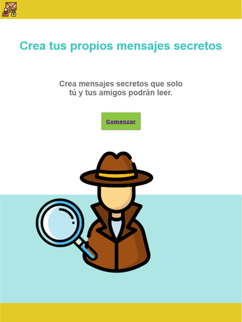
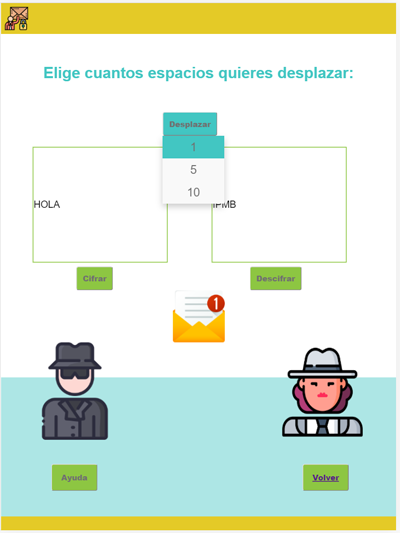
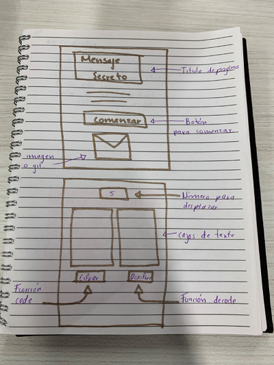

# Mensaje Secreto 🕵️‍♂️

## Índice

* [1. Resumen del proyecto](#1-resumen-del-proyecto)
* [2. Imagen final del proyecto](#2-imagen-final-del-proyecto)
* [3. Investigación UX](#3-investigación-UX)
* [4. Imagen del prototipo final](#4-imagen-del-prototipo-final)

***

## 1. Resumen del proyecto 👩‍💻

El proyecto "Cipher" tiene como objetivo principal desarrollar dos funciones
"code" y "decode", 

## 2. Imagen final del proyecto 📲

## 3. Investigación UX 🔍

  1. Usuarios:
  Este proyecto está dirigido a niños de entre 6años a 10 años, con el objetivo
  de fomentar la lectura, la comunicación y la interacción con otros niños o
  familiares de una forma divertida: ¡enviandose mensajes secretos!
  2. Explicar cómo el producto soluciona los problemas/necesidades de dichos
    usuarios.
  3. Foto del primer prototipo en papel:
  
  4. Feedback:

## 4. Imagen del prototipo final 🎨✏️

